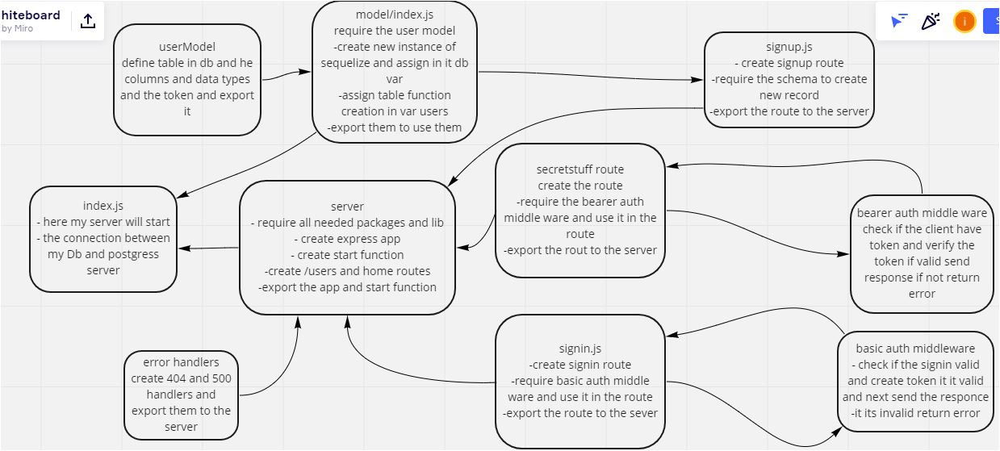

# bearer-auth
in this lab :

- create express server
- create sign in route
- create signup route
- create userModel and use it to create table in DB and assign recordes in it
- crate basic auth middleware : to check the sign in informaion
- use bcrypt to hash the password
- create bearer auth middle ware to check if the client signed i correctly and have the token
- use bcrypt.compare to compare between the inserted password and the hashed password in the DB
- use base64 to decode the password
- create test to check if my routes work prperly
[heroku app]()  
[PR]()  
[actions]()  

